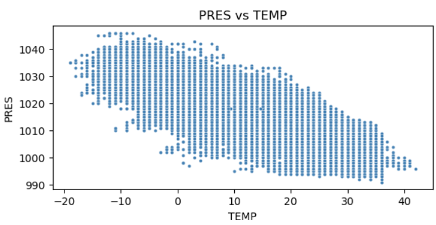
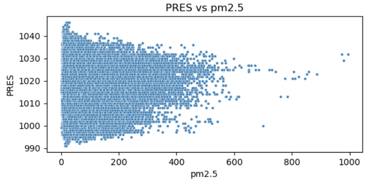
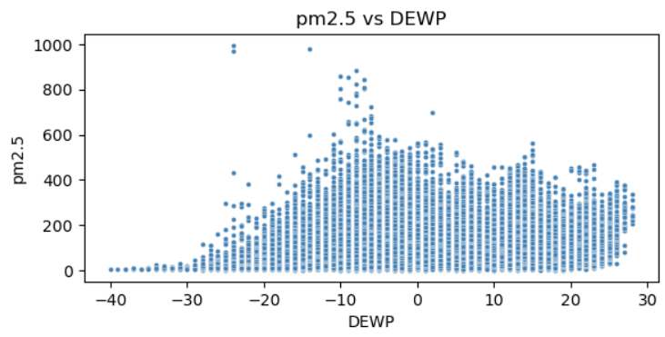
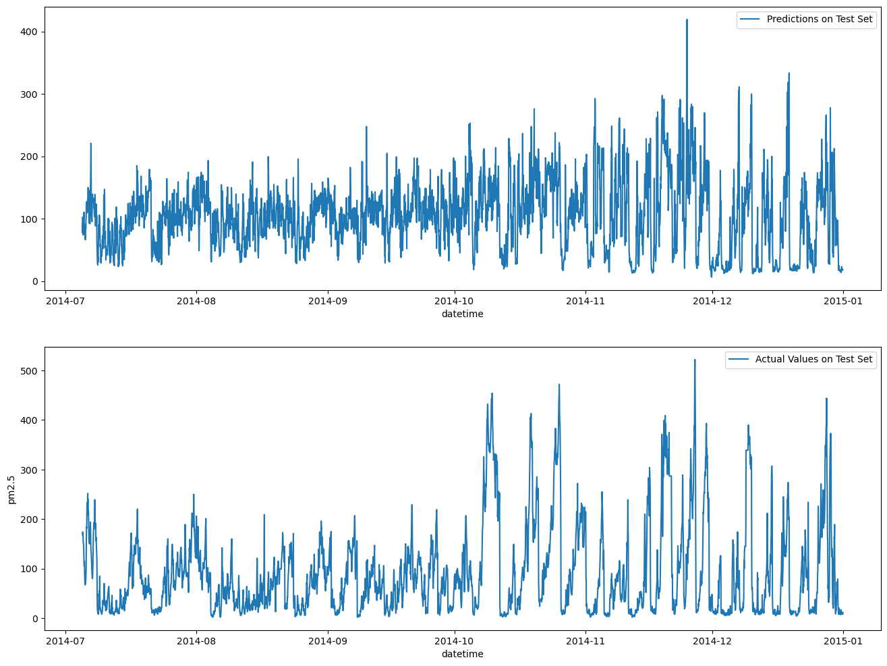
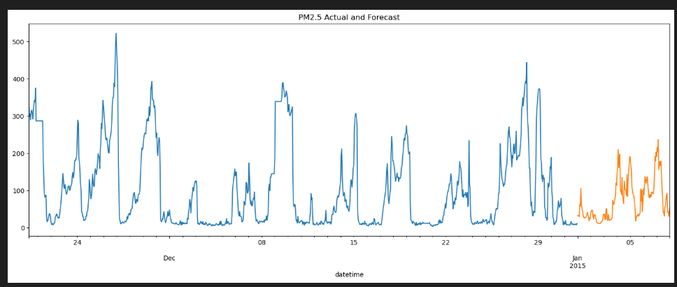

# Forecasting Air Quality in Beijing: Insights from Data Science

## Questions of Interest

1. **How do meteorological factors influence PM2.5 air pollution levels in Beijing?**
2. **Can we have a model to forecast the PM2.5 levels**
3. **How does feature engineering (such as lagged and rolling features) impact the accuracy of PM2.5 forecasts?**

---

## Findings

### 1. How do meteorological factors influence PM2.5 air pollution levels in Beijing?

- **PM2.5 levels** show strong seasonality, with higher concentrations during colder months.
- **Temperature and Dew Point** are strongly positively correlated, while **Pressure** is strongly negatively correlated with both.
- **High PM2.5 events** often coincide with low temperatures and high pressure.

**Supporting Statistic:**

|         | pm2.5    | PRES     | TEMP     | DEWP     |
|---------|----------|----------|----------|----------|
| pm2.5   | 1.000000 | -0.047282| -0.090534| 0.171423 |
| PRES    | -0.047282| 1.000000 | -0.826903| -0.777722|
| TEMP    | -0.090534| -0.826903| 1.000000 | 0.823821 |
| DEWP    | 0.171423 | -0.777722| 0.823821 | 1.000000 |

**Visual:**

---

### 2. Can we have a model to forecast the PM2.5 levels

- A Random Forest model was trained using lagged features and rolling statistics.
- **Train MSE:** ~370
- **Test MSE:** ~6446
- The model captures general trends but struggles with extreme events, indicating room for improvement.

**Supporting Table:**

| Fold | Train MSE | Test MSE |
|------|-----------|----------|
| 1    |   338.62  |  7108.58 |
| 2    |   350.99  |  8022.01 |
| 3    |   392.57  |  4680.01 |
| 4    |   392.41  |  6917.86 |
| 5    |   409.99  |  5499.66 |

### 3. How does feature engineering (such as lagged and rolling features) impact the accuracy of PM2.5 forecasts?

- Adding lagged and rolling features improved the model's ability to capture temporal dependencies in PM2.5 levels.
- Feature engineering helped reduce overfitting and provided more stable predictions across different time periods.
- However, even with engineered features, the model still struggled with sudden spikes and extreme pollution events, suggesting the need for further enhancements or additional data sources.

### Actual vs Forecast

### Forecast - 1 week in Advance

---

## Conclusion

Meteorological factors play a significant role in Beijing's air quality, and machine learning models can provide useful forecasts. However, further improvements are needed to better capture extreme pollution events and generalize to new data. Future work should focus on advanced models, richer features, and external data sources.
